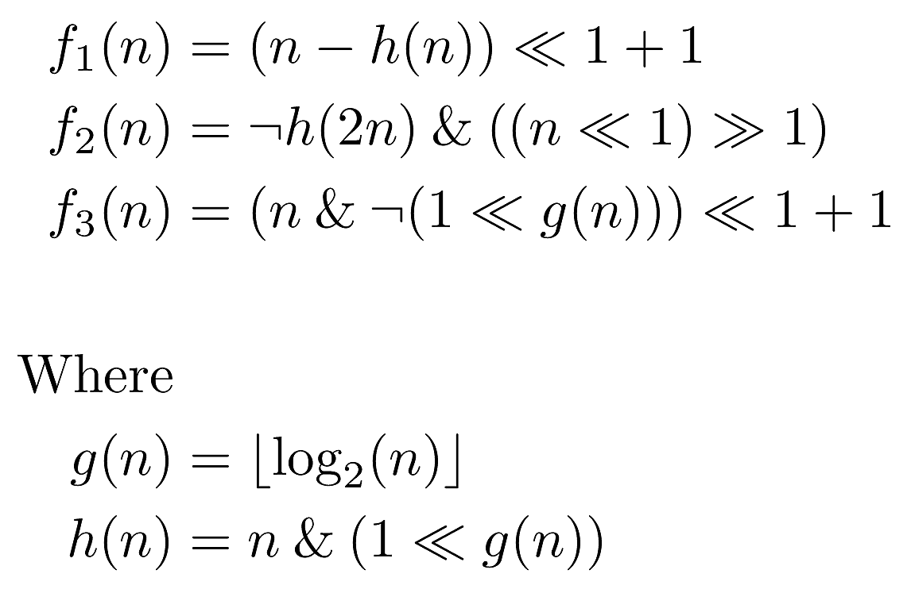
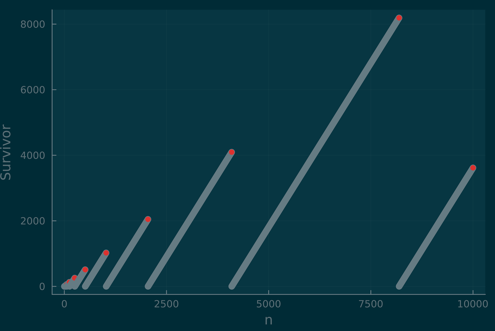

<h1 align="center">Josephus Problem</h1>

## Description

n people numbered from 1 to n stand in a circle.  1 has a sword, kills 2, and passes the sword to 3, who kills 4 and passes the sword to 5, and so on.  This is repeated until only one person remains.  Which number &le; n does the survivor have?

You can read more about this problem [on Wikipedia](https://en.wikipedia.org/wiki/Josephus_problem).

## Quick Start

```julia-repl
julia> using JosephusProblem

julia> josephus_perm(100)
73
```

## Calculation

We calculate the result using the bitwise formulae f<sub>i</sub>:



We can see a pattern that emerges which illustrates these formulae nicely:



## Citation

If your research depends on JosephusProblem.jl, please consider giving us a formal citation: [`citation.bib`](./citation.bib).
